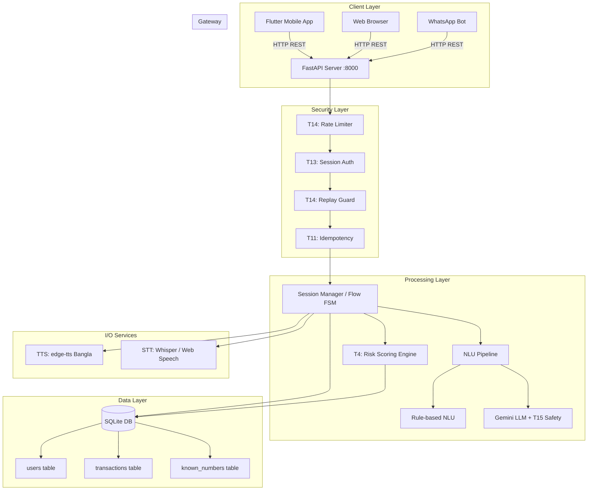

# T9: Architecture Diagram — upay Voice Guard

## System Architecture Overview

```
┌─────────────────────────────────────────────────────────────────────┐
│                         CLIENT LAYER                                │
│  ┌─────────────┐  ┌─────────────┐  ┌──────────────┐               │
│  │ Flutter App  │  │ Web Browser │  │ WhatsApp Bot │               │
│  │ (Mobile)     │  │ (Desktop)   │  │ (Cloud API)  │               │
│  └──────┬───────┘  └──────┬──────┘  └──────┬───────┘               │
│         │                 │                 │                       │
│         └────────────┬────┘─────────────────┘                      │
│                      │  HTTP/REST (JSON)                           │
└──────────────────────┼──────────────────────────────────────────────┘
                       │
         ┌─────────────▼─────────────┐
         │    NETWORK BOUNDARY       │
         │  LAN / Mobile Hotspot     │
         │  172.20.10.x / USB ADB    │
         │  CORS: LAN subnets only   │
         └─────────────┬─────────────┘
                       │
┌──────────────────────┼──────────────────────────────────────────────┐
│                      │     SERVER LAYER (FastAPI)                   │
│  ┌───────────────────▼───────────────────┐                         │
│  │          SECURITY MIDDLEWARE           │                         │
│  │  ┌─────────────────────────────────┐  │                         │
│  │  │ T14: Rate Limiting (30 req/min) │  │                         │
│  │  │ T14: IP Lockout (50 req → 5min) │  │                         │
│  │  │ T14: Nonce Replay Protection    │  │                         │
│  │  │ T13: Session Token (SHA-256)    │  │                         │
│  │  │ T14: Audit Logging              │  │                         │
│  │  └─────────────────────────────────┘  │                         │
│  └───────────────────┬───────────────────┘                         │
│                      │                                              │
│  ┌───────────────────▼───────────────────┐                         │
│  │           API ENDPOINTS               │                         │
│  │                                       │                         │
│  │  POST /session/start  → new session   │                         │
│  │  POST /session/{sid}/input → step     │                         │
│  │  POST /tts            → speech audio  │                         │
│  │  POST /stt            → transcribe    │                         │
│  │  GET  /user/info      → balance/txns  │                         │
│  │  GET  /limit          → read limit    │                         │
│  │  PUT  /limit          → set limit     │                         │
│  │  GET  /health         → liveness      │                         │
│  │  GET  /audit          → security log  │                         │
│  └───────┬───────────────────┬───────────┘                         │
│          │                   │                                      │
│  ┌───────▼───────┐   ┌──────▼────────┐                             │
│  │  SESSION MGR  │   │  TTS ENGINE   │                             │
│  │ (flow.py)     │   │ (edge-tts)    │                             │
│  │               │   │ bn-BD-Nabanita│                             │
│  │ States:       │   └───────────────┘                             │
│  │  PIN → MENU   │                                                  │
│  │  → NUMBER     │   ┌───────────────┐                             │
│  │  → NUMBER_OK  │   │  STT ENGINE   │                             │
│  │  → AMOUNT     │   │ (stt.py)      │                             │
│  │  → RISK       │   │ Whisper/API   │                             │
│  │  → FINAL      │   └───────────────┘                             │
│  │  → END        │                                                  │
│  └───────┬───────┘                                                  │
│          │                                                          │
│  ┌───────▼──────────────────────────────────────────┐              │
│  │              NLU PIPELINE                         │              │
│  │                                                   │              │
│  │  ┌───────────┐    ┌──────────────┐               │              │
│  │  │ Rule-NLU  │───►│ Gemini LLM   │               │              │
│  │  │ (nlu.py)  │    │ (llm_nlu.py) │               │              │
│  │  │           │    │              │               │              │
│  │  │ Keywords: │    │ Fallback for │               │              │
│  │  │ • Bangla  │    │ ambiguous    │               │              │
│  │  │ • Banglish│    │ inputs       │               │              │
│  │  │ • Dialects│    │              │               │              │
│  │  │ • ASR err │    │ T15: Prompt  │               │              │
│  │  └───────────┘    │ injection    │               │              │
│  │                   │ detection    │               │              │
│  │  Combined         │ + output     │               │              │
│  │  Accuracy: 98.8%  │ validation   │               │              │
│  │                   └──────────────┘               │              │
│  │                                                   │              │
│  │  ┌───────────────────────────────────┐           │              │
│  │  │ T4: Personalized Risk Scoring     │           │              │
│  │  │                                   │           │              │
│  │  │ 5 behavioral signals:             │           │              │
│  │  │  1. Recipient novelty             │           │              │
│  │  │  2. Amount vs historical avg      │           │              │
│  │  │  3. Balance ratio (% withdrawn)   │           │              │
│  │  │  4. Daily frequency               │           │              │
│  │  │  5. Rapid succession              │           │              │
│  │  │                                   │           │              │
│  │  │ Threshold: 0.35 → scam warning    │           │              │
│  │  │ T16: Explainable factors shown    │           │              │
│  │  └───────────────────────────────────┘           │              │
│  └──────────────────────────┬────────────────────────┘              │
│                             │                                       │
│  ┌──────────────────────────▼────────────────────────┐              │
│  │           DATA LAYER (SQLite)                      │              │
│  │                                                    │              │
│  │  ┌──────────┐  ┌──────────────┐  ┌─────────────┐ │              │
│  │  │  users   │  │ transactions │  │known_numbers│ │              │
│  │  │          │  │              │  │             │ │              │
│  │  │ id       │  │ id (auto)    │  │ user_id (PK)│ │              │
│  │  │ name     │  │ user_id (FK) │  │ number (PK) │ │              │
│  │  │ phone    │  │ ts (date)    │  └─────────────┘ │              │
│  │  │ pin_hash │  │ kind         │                   │              │
│  │  │ salt     │  │ counterparty │  T11: Idempotent  │              │
│  │  │ balance  │  │ amount       │  transaction keys │              │
│  │  │ max_txn  │  └──────────────┘  (in-memory cache │              │
│  │  │ failed   │                     with 1hr TTL)   │              │
│  │  │ locked   │                                      │              │
│  │  │ name_tts │                                      │              │
│  │  └──────────┘                                      │              │
│  └────────────────────────────────────────────────────┘              │
└─────────────────────────────────────────────────────────────────────┘
```

## Data Flow: Cash-Out Transaction

```
User                    Flutter App            Voice Guard Server          SQLite DB
 │                         │                         │                        │
 │  1. Tap "Start"         │                         │                        │
 │────────────────────────►│                         │                        │
 │                         │  POST /session/start     │                        │
 │                         │────────────────────────►│                        │
 │                         │  {sid, token, say}       │                        │
 │                         │◄────────────────────────│                        │
 │  2. "Enter PIN"         │                         │                        │
 │◄────────────────────────│                         │                        │
 │                         │                         │                        │
 │  3. Keypad: 1234        │                         │                        │
 │────────────────────────►│                         │                        │
 │                         │  POST /session/{sid}/input│                       │
 │                         │  {kind:"keypad",value:"1234"}                    │
 │                         │────────────────────────►│  check_pin()           │
 │                         │                         │───────────────────────►│
 │                         │                         │  ok / wrong / locked   │
 │                         │                         │◄───────────────────────│
 │  4. "Hello, how         │  {say:"Hello..."}       │                        │
 │      can I help?"       │◄────────────────────────│                        │
 │◄────────────────────────│                         │                        │
 │                         │                         │                        │
 │  5. Voice: "cash out"   │  STT → text             │                        │
 │────────────────────────►│────────────────────────►│                        │
 │                         │  NLU: parse_intent()    │                        │
 │                         │  → {intent: "cash_out"} │                        │
 │  6. "Enter agent no."   │◄────────────────────────│                        │
 │◄────────────────────────│                         │                        │
 │                         │                         │                        │
 │  7. Keypad: 01811111111 │                         │                        │
 │────────────────────────►│────────────────────────►│  validate number       │
 │  8. "Confirm number?"   │◄────────────────────────│                        │
 │◄────────────────────────│                         │                        │
 │  9. Voice: "হ্যাঁ"      │────────────────────────►│                        │
 │                         │                         │                        │
 │  10. "Enter amount"     │◄────────────────────────│                        │
 │◄────────────────────────│                         │                        │
 │  11. Keypad: 4000       │────────────────────────►│                        │
 │                         │                         │  get_risk_signals()    │
 │                         │                         │───────────────────────►│
 │                         │                         │  {score, factors}      │
 │                         │                         │◄───────────────────────│
 │                         │                         │                        │
 │  12a. IF risky:         │                         │                        │
 │  "Warning: [factors]"   │◄────────────────────────│                        │
 │  "Is this your decision?"                         │                        │
 │◄────────────────────────│                         │                        │
 │  12b. Voice: "হ্যাঁ"    │────────────────────────►│                        │
 │                         │                         │                        │
 │  13. "Confirm cash out" │◄────────────────────────│                        │
 │◄────────────────────────│                         │                        │
 │  14. Voice: "হ্যাঁ"     │────────────────────────►│  cash_out()            │
 │                         │                         │───────────────────────►│
 │                         │                         │  new_balance           │
 │                         │                         │◄───────────────────────│
 │  15. "Success! ৪০০০ TK" │◄────────────────────────│                        │
 │◄────────────────────────│                         │                        │
```

## Security Architecture

```
┌─────────────────────────────────────────────────────┐
│              SECURITY LAYERS                         │
│                                                      │
│  Layer 1: NETWORK                                    │
│  ├─ CORS restricted to LAN subnets only              │
│  ├─ No public internet exposure (LAN-only)           │
│  └─ ADB reverse port forwarding (USB)                │
│                                                      │
│  Layer 2: TRANSPORT                                  │
│  ├─ Rate limiting: 30 req/min per IP                 │
│  ├─ Lockout: 50 req → 5-minute IP ban               │
│  └─ Nonce-based replay protection                    │
│                                                      │
│  Layer 3: SESSION                                    │
│  ├─ SHA-256 hashed session tokens (X-Session-Token)  │
│  ├─ Token verified on every /session/{sid}/input     │
│  └─ Session cleanup on end                           │
│                                                      │
│  Layer 4: TRANSACTION                                │
│  ├─ Idempotency keys (X-Idempotency-Key, 1hr TTL)   │
│  ├─ Atomic SQL: balance check + debit in one UPDATE  │
│  └─ Server-side limit enforcement (not client-only)  │
│                                                      │
│  Layer 5: AI SAFETY                                  │
│  ├─ T15: Prompt injection detection (13 patterns)    │
│  ├─ T15: Input sanitization (control chars, length)  │
│  ├─ T15: LLM output whitelist validation             │
│  ├─ Keypad-only for sensitive data (PIN, amount, no.)│
│  └─ LLM never moves money — only classifies intent   │
│                                                      │
│  Layer 6: FRAUD DETECTION                            │
│  ├─ T4: 5-signal personalized risk scoring           │
│  ├─ Explainable warnings (user sees WHY)             │
│  ├─ PIN lockout after 3 failures                     │
│  └─ Audit log for all security events                │
│                                                      │
│  Layer 7: DATA PROTECTION                            │
│  ├─ PIN hashed with PBKDF2-HMAC-SHA256 (50k rounds)  │
│  ├─ Per-user random salt                             │
│  ├─ Timing-safe comparison (hmac.compare_digest)     │
│  └─ All data is synthetic (demo only)                │
└─────────────────────────────────────────────────────┘
```

## Conversation State Machine

```
                    ┌─────┐
                    │START│
                    └──┬──┘
                       │
                  ┌────▼────┐
           ┌─────│   PIN    │◄──── wrong PIN (up to 3x)
           │     └────┬─────┘
           │          │ correct
     locked│     ┌────▼────┐
           │     │  MENU   │◄──── "আর কিছু?" (loop back)
           │     └──┬──┬───┘
           │        │  │
           │   cash_out│  balance/spending/faq/bye
           │        │  │
           │   ┌────▼────┐
           │   │ NUMBER  │◄──── wrong number (up to 3x)
           │   └────┬────┘
           │        │ valid
           │   ┌────▼─────┐
           │   │NUMBER_OK │◄──── "ঠিক নয়" → re-enter
           │   └────┬─────┘
           │        │ "হ্যাঁ"
           │   ┌────▼────┐
           │   │ AMOUNT  │◄──── invalid (up to 2x)
           │   └────┬────┘
           │        │ valid
           │        │
           │   ┌────▼────┐
           │   │  RISK   │ (only if risk score ≥ 0.35)
           │   └──┬──┬───┘
           │      │  │
           │  "না"│  │"হ্যাঁ"
           │      │  │
           │   ┌──▼──▼──┐
           │   │ FINAL  │
           │   └──┬──┬──┘
           │      │  │
           │  "না"│  │"হ্যাঁ" → cash_out() → success
           │      │  │
           ▼      ▼  ▼
        ┌─────────────┐
        │     END     │
        └─────────────┘
```

## Production Migration Path

For production deployment, the following in-memory components should be replaced:

| Current (Demo)         | Production Target              | Rationale                          |
|------------------------|--------------------------------|------------------------------------|
| In-memory `SESSIONS`   | Redis / PostgreSQL sessions    | Multi-instance, crash recovery     |
| SQLite `voice_guard.db`| PostgreSQL / MySQL             | Concurrency, ACID, replication     |
| In-memory rate limits  | Redis + sliding window         | Shared across server instances     |
| In-memory audit log    | ELK / CloudWatch / structured  | Persistent, searchable, alertable  |
| In-memory idempotency  | Redis with TTL                 | Shared across instances            |
| `edge-tts` (HTTP)      | Azure Speech Services          | SLA, lower latency, custom voice   |
| Web Speech API (STT)   | Azure/Google Speech-to-Text    | Server-side, dialect-aware         |

## Mermaid Diagram (Integration Boundary)


